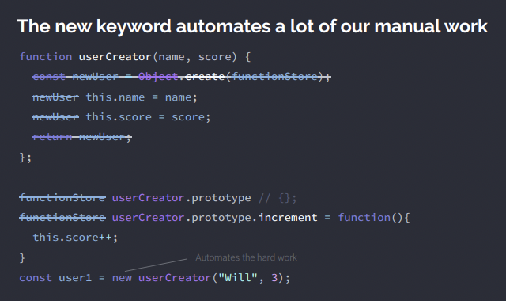
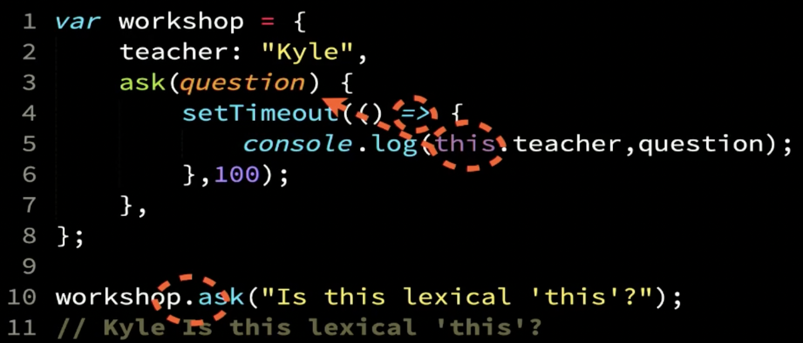

- [Prototype Chains](#prototype-chains)
  - [Concept](#concept)
  - [Trick Question (this resolution)](#trick-question-this-resolution)
  - [Trick Question (this + arrow functions)](#trick-question-this--arrow-functions)
  - [Shortcut Syntax: new operator](#shortcut-syntax-new-operator)
- [The this keyword](#the-this-keyword)
  - [Arrow functions and this keyword](#arrow-functions-and-this-keyword)

## Prototype Chains
### Concept
```js
function userCreator (name, score) {
    const newUser = Object.create(userFunctionStore);
    newUser.name = name;
    newUser.score = score;
    return newUser;
};
const userFunctionStore = {
    increment: function(){this.score++;},
    login: function(){console.log("Logged in");}
};
const user1 = userCreator("Will", 3);
const user2 = userCreator("Tim", 5);
user1.increment();
```
### Trick Question (this resolution)
```js
function userCreator(name, score) {
    const newUser = Object.create(userFunctionStore);
    newUser.name = name;
    newUser.score = score;
    return newUser;
};
const userFunctionStore = {
    increment: function() {
        function add1(){ this.score++; }
        add1()
    }
};
const user1 = userCreator("Will", 3);
const user2 = userCreator("Tim", 5);
user1.increment(); 
```

### Trick Question (this + arrow functions)
```js
function userCreator(name, score) {
 const newUser = Object.create(userFunctionStore);
 newUser.name = name;
 newUser.score = score;
 return newUser;
};
const userFunctionStore = {
 increment: function() {
 const add1 = () => { this.score++; }
 add1()
 }
};
const user1 = userCreator("Will", 3);
const user2 = userCreator("Tim", 5);
user1.increment();
```

### Shortcut Syntax: new operator
```js
    const newObj = Object.create(protoObject);
    ...
    return newObj;

    // can be simplified to
    const userWill = new userCreator("Will", 3);
```



## The this keyword
* Javascript's way of introducing dynamic scope 
* Controlled by how the function is called and not how the function is defined
* Function Invocation Scenarios
    * object.fn() 
    * fn.call(thisContext, ...) or .apply
    * fn.bind(thisArg)()
    * `new` keyword
        * creates new {} object
        * links it to another object
        * Calls function with this pointing to empty object 
        * Returns the object if function didn't return anythin
    * If none of above, then its a default case: `this` points to global/window
* Precedence Order
    * new
    * call or apply (bind effectively uses apply)
    * fn called on context object
    * default to global (window)


### Arrow functions and this keyword
* Arrow fns don't create `this` binding in their execution context
* So it goes to scope-chaining resolution mechanism to figure out what `this` means.
